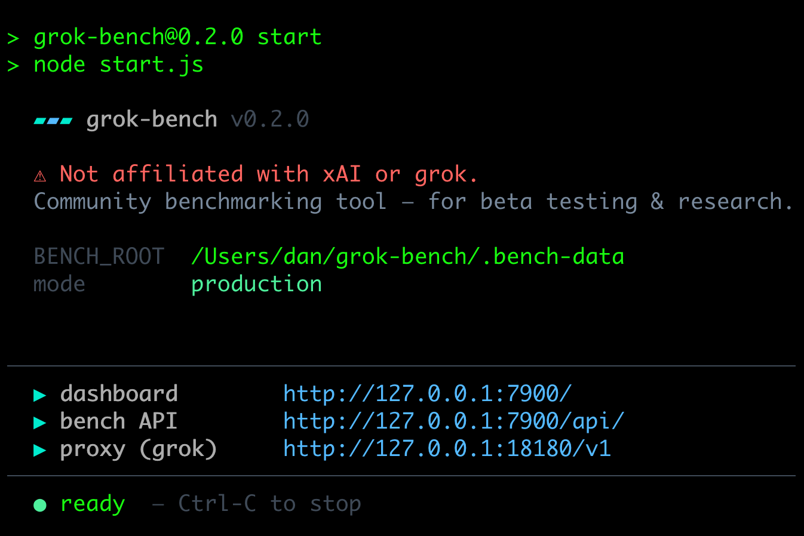
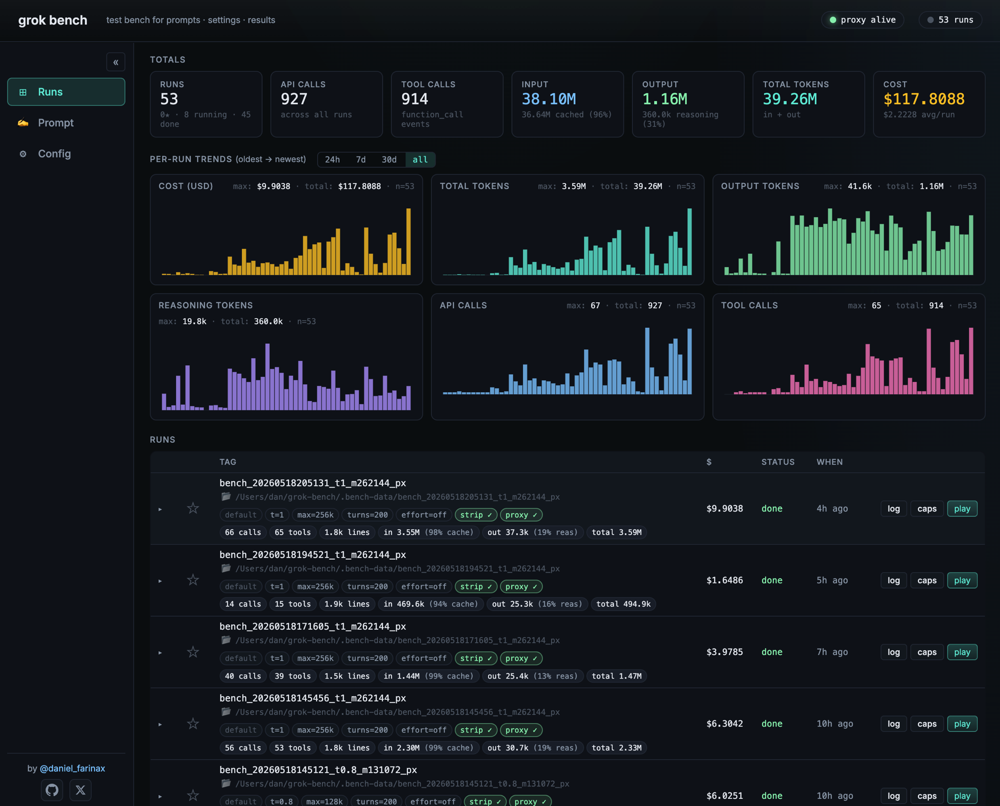
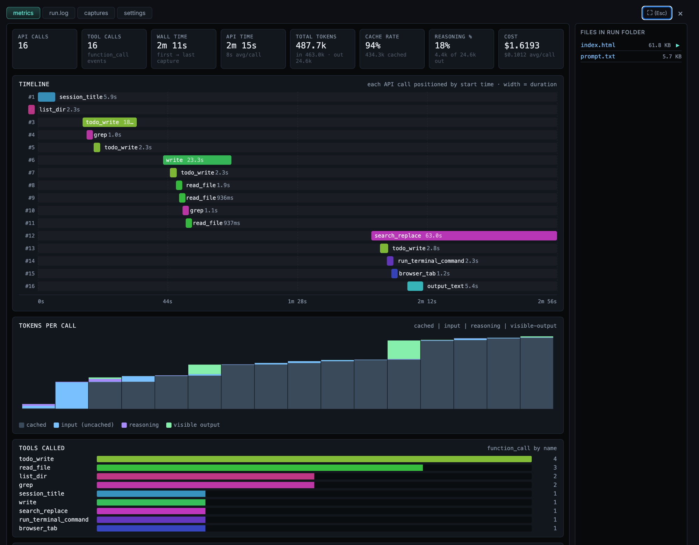

# grok-bench

A test bench for the **Grok CLI** (`grok` / `grok-build`). Lets you A/B different prompts and generation settings, captures every API call with full token & cost metrics, and gives you a live dashboard to compare runs.

Built for one thing: figuring out what settings make Grok produce more elaborate code (games, simulators, complex apps) versus more conservative output.

> ⚠ **Not affiliated with xAI or grok.** Community benchmarking tool — for beta testing & research.

## Quick start

```bash
git clone https://github.com/daniel-farina/grok-bench
cd grok-bench
npm install            # one-time
npm run build          # one-time: builds the dashboard UI
npm start              # serves everything on http://127.0.0.1:7900
```

Open <http://127.0.0.1:7900>. One Node process, two listeners, no Python.

### On startup

`npm start` produces an animated ASCII-art banner (the GROK letters shimmer in, flash, and explode into sparkles before collapsing to a compact one-liner), then a clean status summary with all three URLs and the live readiness indicator:



### The Runs view

Landing page after `Open http://127.0.0.1:7900/`. Top: an 8-tile **totals strip** rolled up from every captured API call across every run (runs, API calls, tool calls, input/output/total tokens, cost). Below: 6 **per-run trend charts** plotting each metric over time (oldest → newest) with selectable 24h / 7d / 30d / all ranges. Below that: the **runs table** — each row is one run with all settings (default/custom prompt, temperature, max tokens, max_turns, effort, strip, proxy) and metrics (calls, tools, lines, in/out/total tokens, cache & reasoning %) as inline chips so the table stays compact:



### Per-run metrics view

Click any row to expand it (default tab: `metrics`). Click `⛶` in the tab strip to maximize to fullscreen for a deep dive. Each capture in the run is rendered as one bar on a Gantt-style **timeline** (colored by tool name, width = duration), a stacked **tokens-per-call** chart (cached / input / reasoning / visible-output), a **tool-call distribution** bar chart, and a cumulative cost line. Files written by the model show up in a collapsible right rail:



## What's inside

```
┌─ http://127.0.0.1:7900 ──────────────────────────┐
│  bench-server.js                                 │
│    GET /              → built UI (bench-ui/dist) │
│    GET /api/*         → runs, captures, files…   │
│    POST /api/run      → spawns grok with isolated│
│                          GROK_HOME + config.toml │
│                                                  │
│  proxy.js (same process, separate port)          │
│    listening on http://127.0.0.1:18180/v1/       │
│    grok-build's base_url points here             │
│    rewrites + captures every /v1/responses call  │
└─ start.js launches both ─────────────────────────┘
```

One process. Two HTTP servers. No external runtime deps beyond Node.

| File | Role |
|---|---|
| **`start.js`** | Launcher: spawns the proxy + bench-server in one process |
| **`bench-server.js`** | REST API + serves the built UI statically. Spawns `grok` with an isolated `GROK_HOME` and an auto-generated `config.toml`. Aggregates per-run token/cost metrics. |
| **`proxy.js`** | HTTP/1.1 reverse proxy on `:18180`. Optionally swaps the system prompt or strips the auto-injected skills `<system-reminder>`. Captures every `/v1/responses` request+response under `<workdir>/captures/`. Node's `http` module handles SSE chunked encoding natively. |
| **`bench-ui/`** | Vite + vanilla JS, no framework. Built once with `npm run build` and served by bench-server. Source in `src/`, build output in `dist/`. |
| **`finalize_run.py`** | Post-run metrics aggregator (the only remaining Python file — short, no deps beyond stdlib, optional). |

## Features

- **Live dashboard** — runs table, totals strip, per-run trend charts (cost, tokens, tool calls, cache-hit rate), expanded panels with always-on file browser
- **Full per-request capture** — request body, SSE response, summarized tool calls, token breakdown, cost (USD ticks), system fingerprint, sampling params — all extracted from xAI's `response.completed` events
- **Per-run metrics view** — timeline (Gantt), stacked tokens per call, tool-call distribution, cumulative cost, cache hit rate
- **System-prompt editor** — load Grok's default 12K system prompt, parse it into 12 sections + ~30 paragraph-level "rules", toggle each individually, apply trimmed version via the rewriting proxy
- **Strip skill catalog** — Grok injects a ~5KB `<system-reminder>` listing every `SKILL.md` on your disk into every request. Toggle it off to save tokens
- **User config editor** — edit `~/.grok/config.toml` with structured toggles, diff against a baseline snapshot, restore from timestamped backups
- **Star runs** to mark winners (persists in localStorage)
- **Cost transparency** — each capture surfaces `cost_in_usd_ticks` from xAI's API echo (this is the actual billing number, not an estimate)

## Setup

### Prerequisites

- **Grok CLI** installed and authenticated (`grok login`). The bench assumes the binary at `~/.grok/bin/grok` (override via `GROK_BIN`).
- **Node.js 20+** (only runtime requirement).

### Commands

| Command | What it does |
|---|---|
| `npm install` | Installs Vite (build-time dep). Run once after cloning. |
| `npm run build` | Builds the dashboard into `bench-ui/dist/`. Run after pulling UI changes. |
| `npm start` | Runs the full stack on `:7900` + `:18180`. |
| `npm run dev` | Runs the stack and *also* spawns Vite dev server on `:7901` for HMR while editing the UI. |

For most users: `npm install && npm run build && npm start`.

## Run a test

1. Open <http://127.0.0.1:7900>
2. Type a prompt in the **User prompt** field on the **Prompt** view
3. Tick **Force inference through proxy** (turns on rewriting + capture)
4. Pick a temperature, max_completion_tokens, max_turns, `--reasoning-effort`
5. Click **▶ Run test** — grok spawns in an isolated workdir under the repo root

Watch the captures stream in live with all metrics. Once the run finishes, click the row to expand it and see the generated HTML/JS/etc., the run.log, every API call, and the metrics timeline.

## How the system-prompt rewriting works

Grok's default system prompt is a 12K char document split into XML-tagged sections (`<tool_calling>`, `<making_code_changes>`, `<formatting>`, etc.) and a couple of markdown headings. The bench includes a parsed copy at `grok_default_system_prompt.txt` for reference.

In the **Prompt** view, click **"Load grok's default…"** and **"Toggle sections…"** to expand it into 12 sections × ~30 rules. Uncheck what you don't want, click **"Apply selected → custom prompt"**:

1. The backend assembles a trimmed version (preserves text between sections — the "preamble")
2. Writes it to `custom_system_prompt.txt` in the repo root
3. Sets the activation flag in state
4. On the next run, the proxy reads `custom_system_prompt.txt` and replaces the system message in every `/v1/responses` request body

Rule-level granularity lets you target specific directives — e.g. removing *"Don't add features beyond what was asked"* (one of three "anti-creativity" rules in `<making_code_changes>`) without losing the whole section.

## File layout

```
grok-bench/
├── start.js                       ← single entry point: starts both servers
├── proxy.js                       ← HTTP rewriting proxy (Node, :18180)
├── bench-server.js                ← REST API + static UI (Node, :7900)
├── finalize_run.py                ← Post-run metrics finalizer (optional)
├── grok_default_system_prompt.txt ← Reference: Grok's stock 12K system prompt
├── package.json                   ← npm scripts + bin entry
├── bench-ui/                      ← Dashboard frontend
│   ├── src/main.js
│   ├── src/style.css
│   ├── index.html
│   ├── package.json               ← Vite + build deps
│   ├── vite.config.js
│   └── dist/                      ← built output (created by `npm run build`)
├── LICENSE
└── README.md
```

At runtime the bench will create (gitignored):

```
bench_<timestamp>_t<T>_m<maxtok>[_px]/    ← one folder per run
├── prompt.txt                            ← the user prompt
├── metrics.json                          ← settings snapshot + aggregated metrics
├── run.log                               ← grok's stdout/stderr
├── captures/                             ← one JSON per /v1/responses call
│   ├── <ts>.json                         ← request + response_summary
│   └── <ts>.sse.txt                      ← raw SSE stream (sidecar)
└── <any files grok wrote>                ← the actual outputs
```

Plus a self-contained `grokhome/` holding the per-bench `GROK_HOME` (sessions, the auto-generated `config.toml`, etc.) — never committed.

## Configuration

Environment variables (optional):

| Variable | Default | What it does |
|---|---|---|
| `BENCH_ROOT` | repo dir | Where bench state + run folders live |
| `BENCH_PORT` | `7900` | Port for the dashboard + REST API |
| `PROXY_PORT` | `18180` | Port for the rewriting proxy (grok's `base_url`) |
| `VITE_PORT` | `7901` | Only used by `npm run dev` for the HMR server |
| `GROK_BIN` | `~/.grok/bin/grok` | Path to the grok binary |

For most setups, defaults work — `cd` into the repo and `npm start`.

## Notes

- **The proxy is required** when you want to use the system-prompt rewriting, reminder stripping, or per-call capture features. Without it, grok talks directly to xAI and the bench just records grok's local session log.
- **`--reasoning-effort`** vs `--effort`: grok-build is a reasoning model and rejects the `--effort` flag (which sets the `reasoningEffort` API param). Use `--reasoning-effort` instead. Valid values: `none, minimal, low, medium, high, xhigh`.
- **Telemetry is disabled** in the auto-generated `config.toml` — grok will otherwise keep a connection open to its Mixpanel endpoint after the agent finishes, blocking process exit.

## License

MIT — see `LICENSE`.
